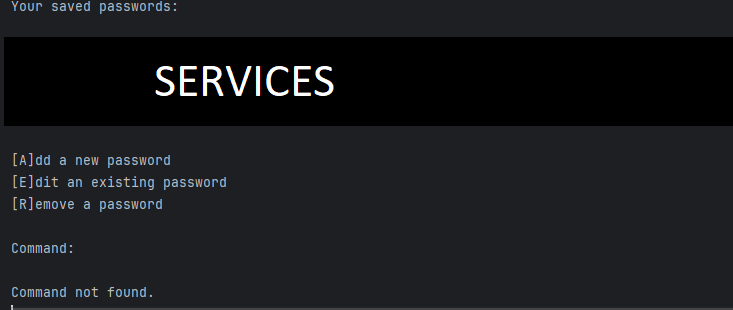

# Password Manager

### This is a personal project, ergo some automation is missing.
### To run the project you'll need:
>- Python 3.13 or higher (don't know if it runs on older versions).
>- A folder called *crypto* in the same dir **manage.py** is.
---
### Once the crypto folder is created, the following files should be created inside it:
>- [X] .env [^1] (Check footnotes)
>- [X] stash.json [^2]
---
### If everything is set up correctly, the program will look like this:

### You may:
+ Enter the exact name of a saved service to retrieve the decrypted password.
+ Enter the letter of an existing command to run.
+ Just press enter anytime to exit.
---
# Tamper protection:
>### This program counts with a rate limiting functionality that will increase the waiting time every time a wrong private key is provided. The rate limit resets to default every time the program is launched.

# Important:
># The program won't run without a properly set

[^1]: This is where the private and public keys are stored. PUBLIC_KEY can be any string, but PRIVATE_KEY must be a Fernet token hashed with blake2b with 64 digest size. Program won't run without these vars.
[^2]: This is where the encrypted passwords get stored. You shouldn't write anything to this file, as the program handles it itself.